# Projektdokumentation - [Concerty]

## Inhaltsverzeichnis

1. [Ausgangslage](#1-ausgangslage)
2. [Lösungsidee](#2-lösungsidee)
3. [Vorgehen & Artefakte](#3-vorgehen--artefakte)
    1. [Understand & Define](#31-understand--define)
    2. [Sketch](#32-sketch)
    3. [Decide](#33-decide)
    4. [Prototype](#34-prototype)
    5. [Validate](#35-validate)
4. [Erweiterungen [Optional]](#4-erweiterungen-optional)
5. [Projektorganisation [Optional]](#5-projektorganisation-optional)
6. [KI-Deklaration](#6-ki-deklaration)
7. [Anhang [Optional]](#7-anhang-optional)

> **Hinweis:** Massgeblich sind die im **Unterricht** und auf **Moodle** kommunizierten Anforderungen.cb

<!-- WICHTIG: DIE KAPITELSTRUKTUR DARF NICHT VERÄNDERT WERDEN! -->

<!-- Diese Vorlage ist für eine README.md im Repository gedacht. Abschnitte mit [Optional] können weggelassen werden, wenn in den Übungen nichts anderes verlangt wird. -->

## 1. Ausgangslage
Musikfans, die regelmässig Konzerte besuchen, haben keinen zentralen Ort, um ihre Erlebnisse zu dokumentieren, bevorstehende Events zu verwalten und einen Überblick über ihre Lieblingsartists zu behalten. Vorhandene Tools wie Notiz-Apps sind zu generisch; spezialisierte Plattformen wie Last.fm fokussieren auf Streaming, nicht auf Live-Erlebnisse. Concerty schliesst diese Lücke als persönliche Konzert-Tracking-App.

- **Problem:** Es gibt keine einfache, persönliche Lösung, um vergangene Konzertbesuche festzuhalten (inkl. Fotos, Bewertungen, Setlists), bevorstehende Konzerte im Blick zu behalten und Lieblingsartists mit Links zu Spotify und Apple Music zu verwalten.
- **Ziele:**
  - Eigene Konzerte speichern, bewerten (1–5 Sterne) und mit Fotos sowie Setlists ergänzen
  - Bevorstehende und vergangene Konzerte in einer Listen-, Karten- und Kalenderansicht verwalten
  - Lieblingsartists mit Genre, Notizen und Streaming-Links zentral ablegen
  - Daten sicher und geräteübergreifend in der Cloud (MongoDB Atlas) synchronisieren
- **Primäre Zielgruppe:** Musikfans ab 18, die regelmässig Konzerte besuchen und ihre Live-Erlebnisse digital festhalten möchten wie ein Konzert Tagebuch für sich.
- **Weitere Stakeholder [Optional]:** Keine.

## 2. Lösungsidee
Concerty ist eine webbasierte Applikation, bei der sich Nutzerinnen und Nutzer registrieren und einloggen können, um ihre Konzertdaten personalisiert zu speichern. Alle Daten werden pro Collections (concerts, artists) in der Datenbank gespeichert und sind auf jedem Gerät verfügbar.

- **Kernfunktionalität:**
  - **Konzertverwaltung:** Konzerte aus einem Entdeckungsbereich übernehmen oder manuell hinzufügen; Ansicht als Liste, Karte (Leaflet) oder Kalender
  - **Detailansicht:** Konzertinfos, Sternebewertung, Fotoalbum mit Lightbox-Navigation, Setlist-Editor
  - **Artists-Seite:** Lieblingsartists alphabetisch verwalten, Genre und Notizen pflegen, Spotify- und Apple-Music-Links hinterlegen
  - **Explore:** Konzerte entdecken und direkt in die eigene Liste übernehmen
- **Annahmen [Optional]:** Nutzerinnen und Nutzer sind bereit, Konzertdaten manuell einzutragen, da keine externe Ticket- oder Event-API integriert ist.
- **Abgrenzung [Optional]:** Kein Ticketkauf, kein soziales Netzwerk/Feed, keine Push-Benachrichtigungen.

## 3. Vorgehen & Artefakte
Die Durchführung erfolgt phasenbasiert; hier sind die wichtigsten Ergebnisse je Phase dokumentiert.

### 3.1 Understand & Define
- **Zielgruppenverständnis:** Die primäre Zielgruppe sind junge Erwachsene, die aktiv Konzerte besuchen und ein digitales Gedächtnis für ihre Live-Erlebnisse suchen. Konzertgängerinnen und -gängern haben meistens ihre Fotos und Setlists als eine zentrale Erinnerung, die bisher verstreut in Kamera-Rolls, Notizen und sozialen Medien liegen. Eine Proto-Persona ist „Mia, 26, geht ca. 15 Konzerte pro Jahr, fotografiert viel, möchte wissen welche Artists sie wie oft gesehen hat".
- **Wesentliche Erkenntnisse:**
  - Nutzerinnen und Nutzer wollen schnell ein Konzert als „besucht" markieren können
  - Fotos und Setlists sind die wichtigsten Inhalte für vergangene Konzerte
  - Eine Kartenansicht hilft, sich an Veranstaltungsorte zu erinnern
  - Artists-Verwaltung mit direkten Streaming-Links spart Suche und Zeit

### 3.2 Sketch
- **Variantenüberblick:** Drei grundlegende Varianten für die Hauptseite wurden skizziert: (A) einfache Liste - Kachel-/Grid-Layout, (B) Kalenderansicht (C) Kartenansicht.
- **Skizzen:**
  - **Variante A – Liste:** Kompakte Einträge mit Artist, Datum und Bewertung; schnell erfassbar, wenig visueller Aufwand, Kacheln mit Coverbild-Platzhalter; ansprechender, aber mehr Pflegeaufwand für Bilder
  - **Variante B – Kalender:** Monatliche Kalenderüberischt mit Einträgen gemäss Konzertdaten
  - **Variante C – Karte:** Direkter geografischer Überblick; gut für Vielreisende, aber ungeeignet als Standardansicht für Nutzerinnen und Nutzer mit lokalen Konzerten

### 3.3 Decide
- **Gewählte Variante & Begründung:** Variante A (Liste) als Standard, ergänzt durch Karte und Kalender als optionale Ansichten. Die Liste ist am schnellsten nutzbar und erfordert keine zusätzlichen Assets. Karte und Kalender wurden als Tabs ergänzt, um den Mehrwert der anderen Varianten nicht zu verlieren. Entscheidungskriterien: Einfachheit, Geschwindigkeit, geringer Pflegeaufwand.
- **End-to-End-Ablauf:** Nutzer registriert sich → loggt sich ein → entdeckt Konzerte in „Explore" oder fügt eigene hinzu → speichert Konzert in „My Concerts" → nach dem Konzert: fügt Bewertung, Fotos und Setlist hinzu → verwaltet Lieblingsartists auf der Artists-Seite. Der zentrale Workflow ist als Flussdiagramm dokumentiert: [workflow_hauptworkflow.drawio](workflow_hauptworkflow.drawio)
- **Mockup:** Wireframes wurden als Handskizzen auf Papier erstellt und direkt in den Prototyp überführt; Figma Mockup Link: https://www.figma.com/design/jzatiOfbFIXRADEbOeUObt/Concert-Tracker-SW10?node-id=0-1&t=Nsag4oudscvTxSLF-1
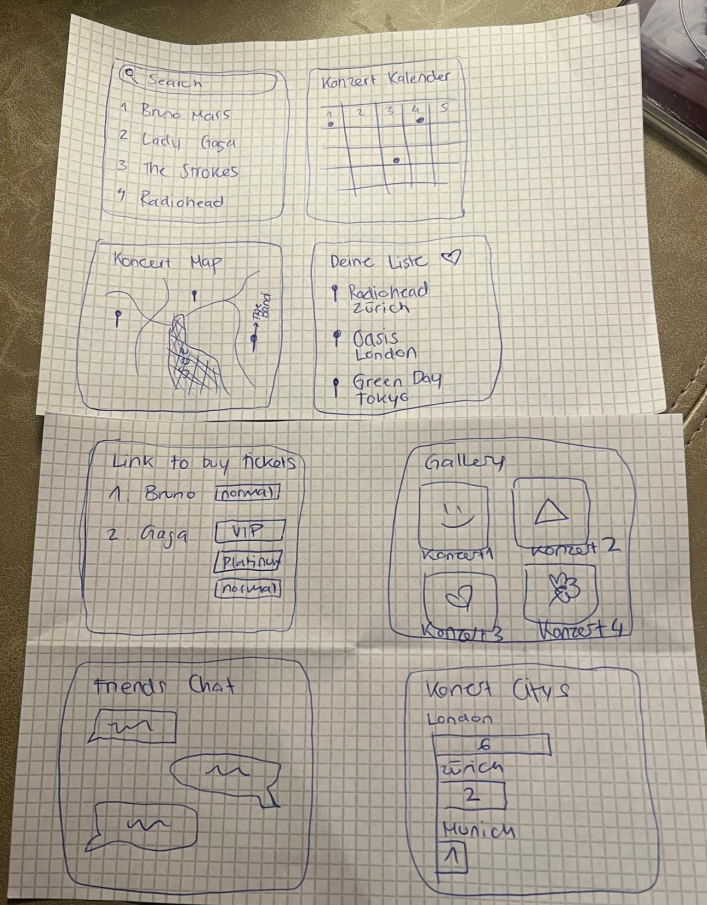

### 3.4 Prototype

#### 3.4.1. Entwurf (Design)
Beschreibt die Gestaltung und Interaktion.
> **Hinweis:** Hier wird der **Prototyp** beschrieben, nicht das **Mockup**.
- **Informationsarchitektur:** Die App ist in fünf Hauptbereiche gegliedert, erreichbar über eine fixe Navbar: My Concerts (Übersicht eigener Konzerte), Artists (Lieblingsartists), Explore (Konzerte entdecken), Connect (Mit anderen Die ans Konzert gehen connecten) und Profile. Jedes Konzert hat eine eigene Detailseite unter `/concert/[id]`.
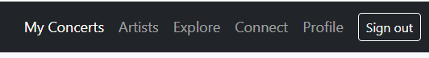
- **User Interface Design:**
  - **My Concerts:** Tabs für Listen-, Karten- und Kalenderansicht; vergangene Konzerte zeigen Bewertungssterne, Foto-Thumbnails und Kamera-Upload
  - **Detailseite:** Kompakte Informationskarte (Artist, Venue, Datum, Genre), darunter Fotoalbum mit Lightbox (Tastaturnavigation) und Setlist-Editor
  - **Artists:** Alphabetisch gruppierte Listenansicht mit Avatar-Kreis (farbig nach Genre), Streaming-Icons (Spotify/Apple Music), Konzertzähler und Inline-Bearbeitungsformular
  - **Farbsprache:** Genre-Farben (z. B. Pop = Pink, Rock = Blau) als durchgehendes visuelles Element; ansonsten neutrales Weiss/Hellgrau mit Bootstrap-Komponenten
- **Designentscheidungen:**
  - Bootstrap 5 als CSS-Framework für schnelle, responsive Layouts ohne eigenes Design-System
  - Keine Bilder für Konzerte gespeichert – nur nutzereigene Fotos (base64 komprimiert), um Speicher zu sparen
  - Inline-Editing bei Artists statt separatem Modal, um Kontextwechsel zu minimieren

#### 3.4.2. Umsetzung (Technik)
Fasst die technische Realisierung zusammen.
- **Technologie-Stack:**
  - **Frontend:** SvelteKit 2 mit Svelte 5 (Runes-API: `$state`, `$derived`, `$effect`, `$props`)
  - **Backend:** SvelteKit API-Routes (Server-Side, Node.js)
  - **Datenbank:** MongoDB Atlas / Compass (Cloud, NoSQL)
  - **CSS:** Bootstrap 5
  - **Karte:** Leaflet.js (via `@sveltejs/adapter-auto`)
- **Tooling:** Visual Studio Code mit der Svelte-Erweiterung; Git/GitHub für Versionskontrolle; Netlify für Deployment; KI-Einsatz siehe Kapitel 6.
- **Struktur & Komponenten:**
  - `src/routes/+layout.svelte` – Root-Layout mit Navbar, Auth-Guard und Store-Initialisierung
  - `src/routes/+page.svelte` – My Concerts (Liste, Karte, Kalender)
  - `src/routes/concert/[id]/+page.svelte` – Konzertdetail mit Fotos, Setlist, Bewertung
  - `src/routes/artists/+page.svelte` – Artists-Verwaltung
  - `src/routes/explore/+page.svelte` – Konzerte entdecken
  - `src/lib/stores/concerts.svelte.js` – Reaktiver Store (localStorage + Server-Sync)
  - `src/lib/stores/artists.svelte.js` – Reaktiver Store (gleiche Architektur)
  - `src/lib/stores/auth.svelte.js` – Lokale Authentifizierung (kein Server-Auth)
  - `src/routes/api/concerts/`, `src/routes/api/artists/` – REST-Endpunkte (GET, POST, PATCH, DELETE)
- **Daten & Schnittstellen:**
  - Daten werden pro Nutzer (`userEmail`) in MongoDB Datenbank gespeichert
  - Client-seitige Stores cachen Daten in `localStorage` und synchronisieren beim Login mit dem Server
  - Fotos werden clientseitig via Canvas API auf max. 1200 px komprimiert und als base64-String in MongoDB gespeichert
  - API-Requests senden den eingeloggten Nutzer über den HTTP-Header `X-User-Email`
- **Deployment:** https://concertapptracker.netlify.app/
- **Besondere Entscheidungen:**
  - Offline-First-Strategie: `localStorage` als primärer Cache, MongoDB als persistenter Backup-Speicher
  - Svelte 5 Runes statt Svelte 4 Stores, um reaktive Abhängigkeiten explizit und nachvollziehbar zu halten

### 3.5 Validate
- **URL der getesteten Version** (nicht separat deployt aber dafür Screen shots vorher und nacher)
- **Ziele der Prüfung:** Können Nutzerinnen und Nutzer ohne Anleitung ein Konzert hinzufügen, bewerten und ein Foto hochladen? Ist die Navigation zwischen Listen-, Karten- und Kalenderansicht intuitiv? Ist die Artists-Seite selbsterklärend?
- **Vorgehen:** Unmoderierte Tests on-site in der ZHAW und Zuhause (eine Person); Nutzerinnen und Nutzer erhielten Aufgaben schriftlich und wurden beim Arbeiten beobachtet ohne einzugreifen. Wir haben es mit einem Laptop und der deployten App getestet. Es wurde wenigstmöglich eingegrifen bei den Testpersonen und Notizen wurden in einem Word Dokument gemacht.
- **Stichprobe:** 2 Mitstudenten und 1 Freundin als Testpersonen; Profil: Musikinteressierte im Alter 20–35, Smartphone- und Web-affin, keine Vorerfahrung mit der App.
- **Aufgaben/Szenarien:**
  1. Registriere dich und logge dich ein.
  2. Füge ein Konzert, das du kürzlich besucht hast, zu „My Concerts" hinzu.
  3. Du hörst, dass Paramore auf Tour ist. Schau ob sie in deiner Nähe spielen und erstelle einen Eintrag oder speichere das Konzert.
  4. Finde heraus, wie viele Konzerte du insgesamt besucht hast
- **Kennzahlen & Beobachtungen:**
  - Aufgaben 1–2 wurden von allen Testpersonen erfolgreich abgeschlossen. Jedoch hatte die App kein erstes Fenster, um die Personen zu registrieren. Es war direkt einfach eine Profil Seite, dies hat Ihnen nicht gefallen, denn es wurde kein richtiges Konto hinterlegt.
   - **Vorher:** 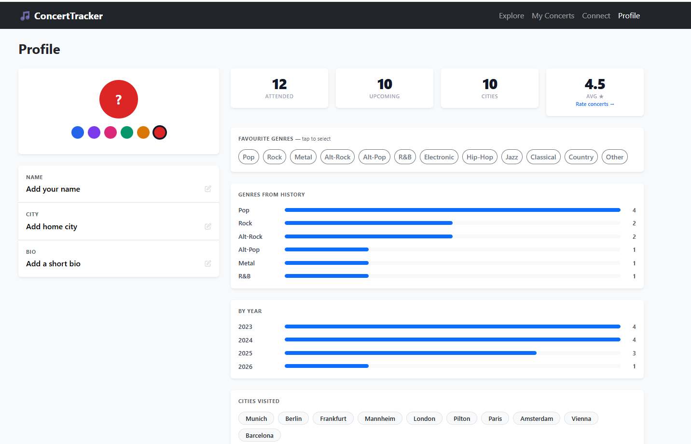
   - **Nacher:** 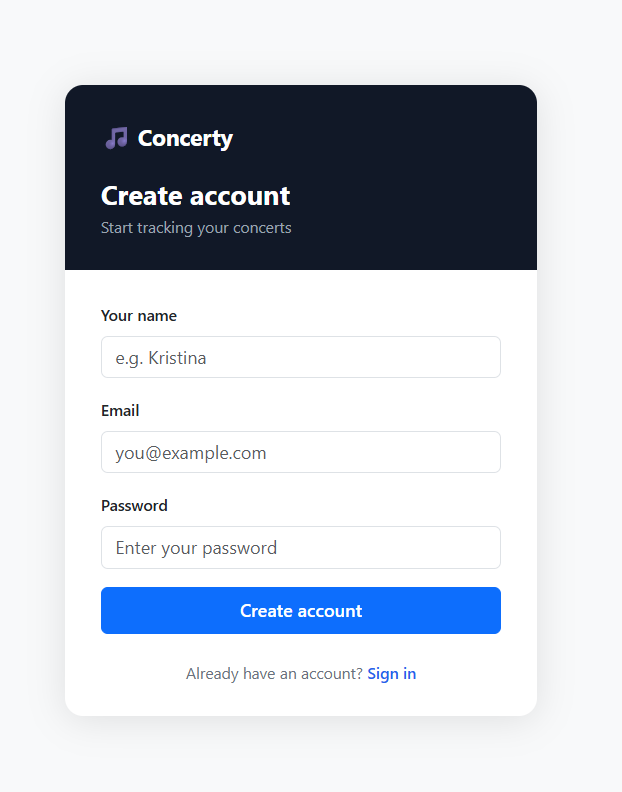
  - Aufgabe 3 war nicht klar in welchem Tab man suchen musste.
  - **Vorher:** Meine Homepage war vorher direkt die Explore Seite und nicht die personalisierte My Concerts Seite. So sieht man seine Konzerte auf ersten Blick und kann bei einer anderen Seite Explore neues suchen mit verlinkten Seiten, die interessant sind für Musikfans.
  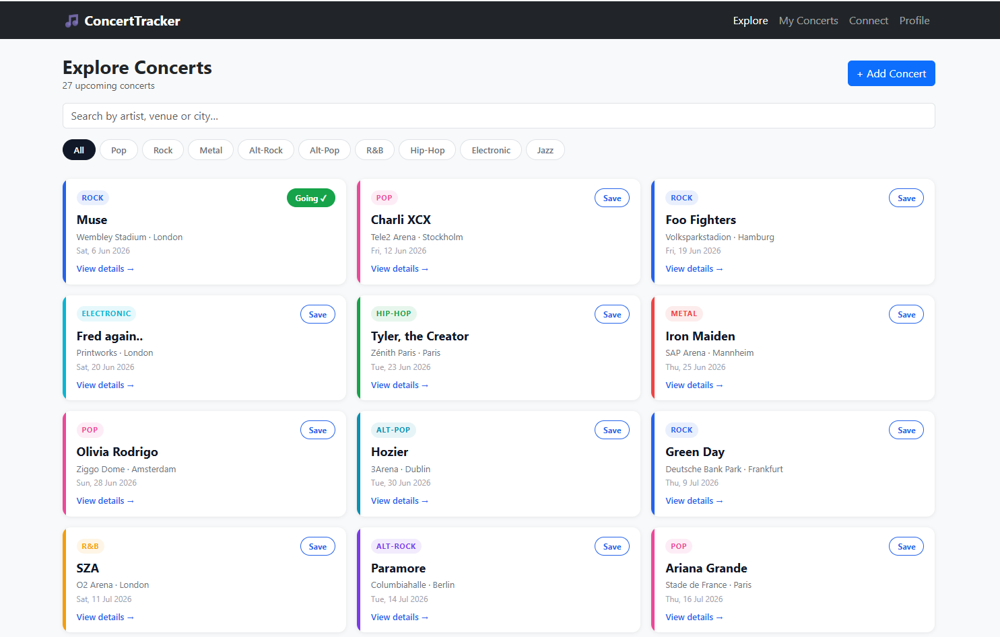
  - **Nacher:** 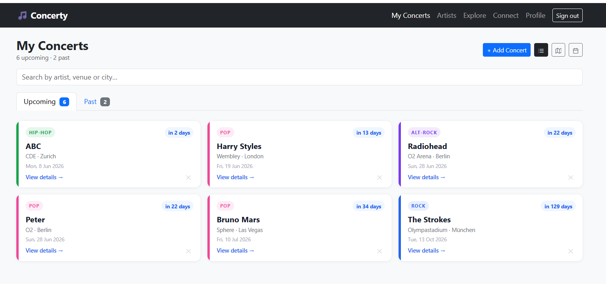 & 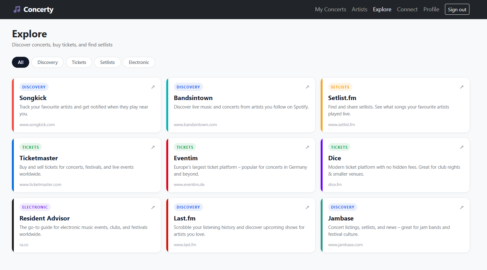
  - Aufgabe 4 wusste man nicht so recht wo man diese Information finden kann bei den Testpersonen
- **Zusammenfassung der Resultate:** Die Kernfunktionen (Konzert hinzufügen, bewerten, Foto hochladen) sind intuitiv und wurden ohne Probleme gefunden. Die Registrierung und Login und die Explore Seite erforderten noch Verbesserungen. Der Unterschied zwischen My Concerts und Explore Page war nicht wirklich verständlich. Die App wurde insgesamt als übersichtlich und schnell wahrgenommen und schön gestaltet. Die Testpersonen fanden die Map-View cool.
- **Abgeleitete Verbesserungen:**
  1. *(Hoch)* Richtiges Registrierungs-/Login erstellen mit Name, Email und Passwort Eingabe
  2. *(Mittel)* My Concerts Seite und Explore Seite gut unterscheiden und Homepage sollte My Concerts sein, da auf ersten Blick das den Nutzer am meisten interessiert zu sehen.
  3. *(Niedrig)* Da die Testpersonen die Map-View sehr toll fanden, habe ich noch eine weitere Ansicht erstellt und zwar die Kalender-View.
  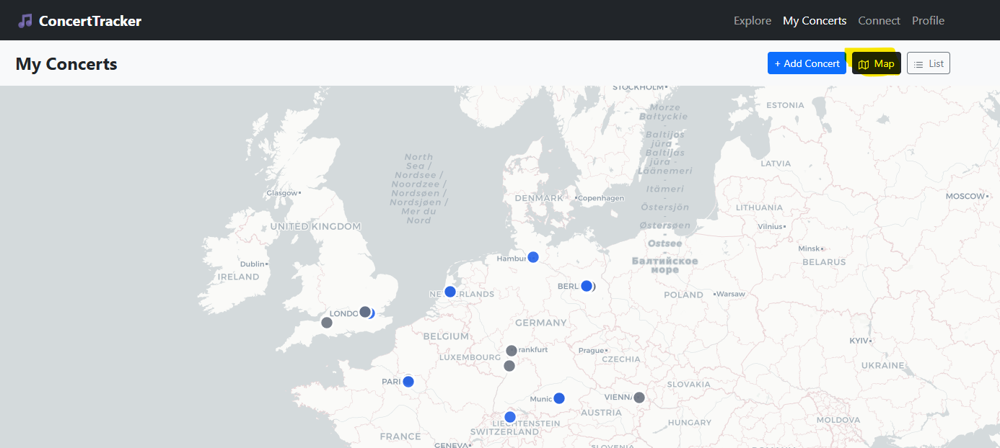 Neu: 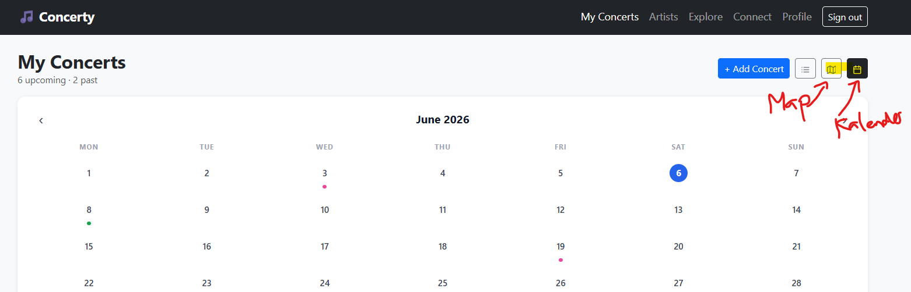

## 4. Erweiterungen [Optional]
Dokumentiert Erweiterungen über den Mindestumfang hinaus.
> **Hinweis:** Jede Erweiterung ist separat nach dem folgenden Schema zu beschreiben.

> Das folgende **Beispiel** wurde bewusst kurz gehalten. Erweiterungen dürfen auch ausführlicher beschrieben werden.

### 4.1 Fotoalbum mit Lightbox auf der Konzertdetailseite
- **Beschreibung & Nutzen:** Nutzerinnen und Nutzer können auf der Detailseite eines vergangenen Konzerts beliebig viele Fotos hochladen. Die Fotos werden in einem Lightbox-Overlay angezeigt, durch das mit Pfeilbuttons oder Tastatur (← →) navigiert werden kann. Dies macht die Detailseite zu einem vollständigen Konzerterlebnis-Tagebuch.
- **Wo umgesetzt:**
  - **Frontend:** Foto-Upload-Label, Thumbnail-Grid und Lightbox-Overlay in `src/routes/concert/[id]/+page.svelte`; Komprimierung via Canvas API in `compressImage()`
  - **Backend:** PATCH-Endpunkt in `src/routes/api/concerts/[id]/+server.js` (Feld `photos`)
  - **Datenbank:** `photos`-Array (base64-Strings) im Konzert-Dokument in MongoDB Atlas
- **Referenz:** Kap. 3.4.1 (UI Design – Detailseite)
- **Aus Evaluation abgeleitet?:** Nein, dies wurde erst später implementiert.

### 4.2 Setlist-Editor auf der Konzertdetailseite
- **Beschreibung & Nutzen:** Für vergangene, gespeicherte Konzerte können Songs der Setlist eingetragen, nummeriert angezeigt und einzeln wieder entfernt werden. Nutzerinnen und Nutzer können so das Konzerterlebnis vollständig dokumentieren.
- **Wo umgesetzt:**
  - **Frontend:** Setlist-Eingabe, nummerierte Liste (CSS Counter) und Entfernen-Button in `src/routes/concert/[id]/+page.svelte`
  - **Backend:** PATCH-Endpunkt in `src/routes/api/concerts/[id]/+server.js` (Feld `setlist`)
  - **Datenbank:** `setlist`-Array (Strings) im Konzert-Dokument in MongoDB Atlas
- **Referenz:** Kap. 3.4.1 (UI Design – Detailseite)
- **Aus Evaluation abgeleitet?:** Nein, eigenständig als sinnvolle Ergänzung für die Konzertdokumentation identifiziert.

### 4.3 Artists-Seite mit Streaming-Links
- **Beschreibung & Nutzen:** Neben Konzerten können Nutzerinnen und Nutzer ihre Lieblingsartists speichern, inkl. Genre, Notizen sowie direkten Links zu Spotify und Apple Music. Die alphabetisch gruppierte Darstellung macht die Liste übersichtlich. Der Konzertzähler zeigt direkt, wie oft man einen Artist live gesehen hat.
- **Wo umgesetzt:**
  - **Frontend:** `src/routes/artists/+page.svelte` mit A-Z-Gruppierung, Inline-Edit, Streaming-Icons
  - **Backend:** `src/routes/api/artists/+server.js` (GET, POST) und `src/routes/api/artists/[id]/+server.js` (PATCH, DELETE)
  - **Datenbank:** Separate `artists`-Collection in MongoDB Atlas, pro Nutzer mit `userEmail` verknüpft
- **Referenz:** Kap. 3.4.1 (UI Design – Artists-Seite)
- **Aus Evaluation abgeleitet?:** Nein, als eigenständige Erweiterung geplant und umgesetzt.

### 4.4 Kalender- und Kartenansicht auf „My Concerts"
- **Beschreibung & Nutzen:** Neben der Standard-Listenansicht können Nutzerinnen und Nutzer ihre Konzerte auf einer interaktiven Karte (Leaflet) oder in einer Monatskalenderansicht betrachten. Die Karte visualisiert Konzert-Venues geografisch; der Kalender zeigt, an welchen Tagen Konzerte stattgefunden haben oder geplant sind.
- **Wo umgesetzt:**
  - **Frontend:** Tab-Umschaltung und beide Ansichten in `src/routes/+page.svelte`; Kartenintegration via Leaflet; Kalender als reines CSS-Grid (7 Spalten)
  - **Backend/Datenbank:** Keine zusätzliche Backend-Logik; alle Daten kommen aus dem bestehenden Konzert-Store
- **Referenz:** Kap. 3.4.1 (UI Design – My Concerts)
- **Aus Evaluation abgeleitet?:** Kalenderansicht war eine direkte Konsequenz aus dem Nutzerfeedback (Wunsch nach zeitlicher Übersicht) und die Tespersonen mochten die Map-View sehr.

### 4.5 Connect-Seite (Mitkonzertgänger finden)
- **Beschreibung & Nutzen:** Auf der Connect-Seite sehen Nutzerinnen und Nutzer ihre bevorstehenden Konzerte und können sich mit anderen Personen vernetzen, die dasselbe Konzert besuchen. Pro Konzert wird angezeigt, wie viele andere ebenfalls hingehen, und ein Gruppen-Chat erlaubt den direkten Austausch (z. B. Treffpunkt, Tickets, Tipps). Dies erweitert die App von einem persönlichen Tagebuch hin zu einer sozialen Komponente rund um Live-Musik.
- **Wo umgesetzt:**
  - **Frontend:** `src/routes/connect/+page.svelte` mit Konzertliste (nur bevorstehende), Teilnehmerliste und Chat-Ansicht pro Konzert
  - **Backend/Datenbank:** Nutzt bestehenden Konzert-Store; Chat-Nachrichten und Mitglieder sind als realistische Mock-Daten hinterlegt
- **Referenz:** Navbar-Eintrag „Connect"
- **Aus Evaluation abgeleitet?:** Nein, eigenständig als soziale Erweiterung ergänzt, um den Community-Aspekt von Konzerten abzubilden.

### 4.6 Rate-Seite (zentrale Bewertungsübersicht)
- **Beschreibung & Nutzen:** Die Rate-Seite bietet eine dedizierte Übersicht aller vergangenen Konzerte, geordnet nach unbewerteten Einträgen zuerst. Nutzerinnen und Nutzer können Sternebewertungen (1–5) direkt setzen oder ändern und persönliche Notizen pro Konzert bearbeiten — ohne in die Detailseite wechseln zu müssen. Dies vereinfacht das nachträgliche Bewerten mehrerer Konzerte erheblich.
- **Wo umgesetzt:**
  - **Frontend:** `src/routes/rate/+page.svelte` mit sortierter Konzertliste, interaktiven Sternbuttons und Inline-Notiz-Editor
  - **Backend:** PATCH-Endpunkt in `src/routes/api/concerts/[id]/+server.js` (Felder `rating` und `notes`)
  - **Datenbank:** `rating` (Number) und `notes` (String) im Konzert-Dokument in MongoDB Atlas
- **Referenz:** Kap. 3.4.1 (UI Design – Detailseite)
- **Aus Evaluation abgeleitet?:** Teilweise, es wurde erwähnt von einer Testperson, dass Notizen zum Konzert eine tolle Zusatzfunktion wären.

## 5. Projektorganisation [Optional]
- **Repository & Struktur:** GitHub-Repository: https://github.com/kpejakovic/concerttracker.git; Struktur folgt dem SvelteKit-Standard mit `src/routes/` für Seiten und API-Routes sowie `src/lib/` für Stores und Assets.
- **Issue-Management:** Anforderungen und Erweiterungen wurden im Verlauf des Projekts direkt als Aufgaben im Gespräch mit Claude Code definiert und iterativ umgesetzt. Issue Tracking wurde im Github als Ticketing system erstellt um nichts zu vergessen und den Entwicklungen zu verfolgen.
- **Commit-Praxis:** Sprechende Commit-Nachrichten auf Englisch in Zahlen ->Nummerierung der Commits.

## 6. KI-Deklaration
Die folgende Deklaration ist verpflichtend und beschreibt den Einsatz von KI im Projekt.

### 6.1 KI-Tools
- **Eingesetzte Tools**: Claude Code (Anthropic), Modell: claude-sonnet-4-6; direkt in VS Code über die Claude Code Extension integriert.
- **Zweck & Umfang**: Claude Code wurde für die gesamte Implementierung des Projekts eingesetzt. Dazu gehören: Erstellung aller Svelte-Komponenten und API-Routes, Store-Architektur (Svelte 5 Runes), CSS-Styling, Fehleranalyse und Debugging. Nahezu alle Codezeilen wurden mit direkter KI-Unterstützung geschrieben oder überarbeitet. Zusätzlich führte Claude Code am Ende des Projekts einen vollständigen Build-Check (`npm run build`) durch, identifizierte dabei mehrere Accessibility-Warnungen (fehlende Label-Verknüpfungen, aria-labels bei Icon-Buttons, tabindex auf Lightbox-Overlay) und behob diese eigenständig. Für das README wurde Claude acuh verwendet.
- **Eigene Leistung (Abgrenzung):** Eigenständig erarbeitet wurden: die Konzeptidee und Problemdefinition, die Entscheidung über Funktionsumfang und Abgrenzung, die Auswahl des Tech-Stacks, das Formulieren aller Anforderungen und Korrekturen in Konversation mit der KI sowie das manuelle Testen und Validieren der Resultate im Browser. Die KI hat auf Basis dieser Vorgaben implementiert. Mongo Db Datenbank wurde selber erstellt aber mithilfe von Claude Code und der Fehleranalyse richtig verbunden.

### 6.2 Prompt-Vorgehen
Die Zusammenarbeit mit Claude Code verlief iterativ und konversationell. Anforderungen wurden in natürlicher Sprache (Deutsch) beschrieben, z. B. „Füge auf der Konzertdetailseite ein Fotoalbum mit Lightbox hinzu". Nach jeder Implementierung wurde die Funktion manuell im Browser getestet. Bei Abweichungen vom gewünschten Verhalten wurde das Problem konkret beschrieben und eine Korrektur angefragt. Grössere Features wurden in mehreren Schritten verfeinert (z. B. Lightbox zuerst ohne, dann mit Vor/Zurück-Navigation). Auf einzelne Codezeilen wurde nicht gepromptet; stattdessen wurden immer vollständige Funktionen oder Seiten als Ziel beschrieben.

### 6.3 Reflexion
Claude Code hat die Entwicklungsgeschwindigkeit erheblich gesteigert und ermöglicht, ein deutlich umfangreicheres Projekt umzusetzen. Besonders hilfreich war die KI bei der Svelte 5 Runes-Syntax und der MongoDB-Integration, da bei der Datenbank einige Fehlermeldungen aufgetretten waren. Als Grenze zeigte sich, dass die KI mehrere Iterationen benötigte, wenn das gewünschte Verhalten sehr spezifisch war (z. B. Lightbox-Animation). Qualitätssicherung erfolgte ausschliesslich durch manuelles Testen; automatisierte Tests wurden nicht erstellt. Risiko: Code, der von der KI generiert wurde, kann subtile Fehler enthalten, die erst im Nutzungstest auffallen – eine eigenständige Überprüfung jedes generierten Codeblocks ist daher wichtig.

## 7. Anhang [Optional]
- **Quellen:** Bootstrap 5 (MIT-Lizenz), Leaflet.js (BSD-Lizenz), SvelteKit (MIT-Lizenz), MongoDB Atlas (proprietär, kostenloser Tier); alle Icons sind SVG-Inline-Icons ohne externe Abhängigkeit.
- **Testskript & Materialien:** Schriftliche Aufgabenkarten wurden für die Nutzertests mündlich übergeben.
- **Rohdaten/Auswertung:** Beobachtungsnotizen aus den Nutzertests.
- **Gebrauchte Fotos (Upload):**Gemacht von Kristina Pejakovic selber am 03.08.2025, London am Oasis Konzert
-**Video Aufnahme:** Man hat es auf dem Video nicht gesehen, deswegen habe ich hier noch screen shots hinzugefügt bei der Erstellung von Konzerten. Es hat beim Datum und Genre eine Auswahlmöglichkeit.
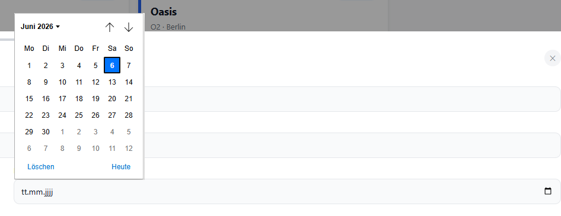
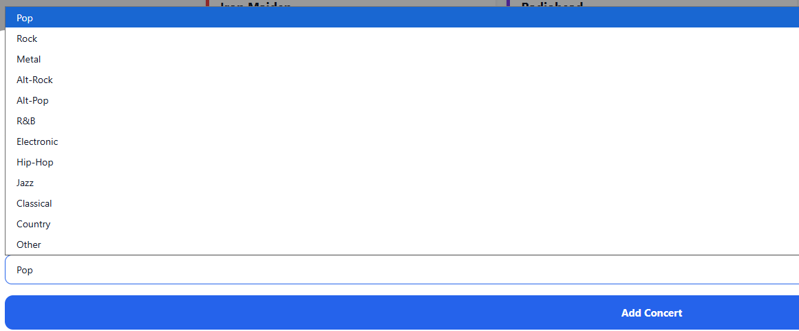